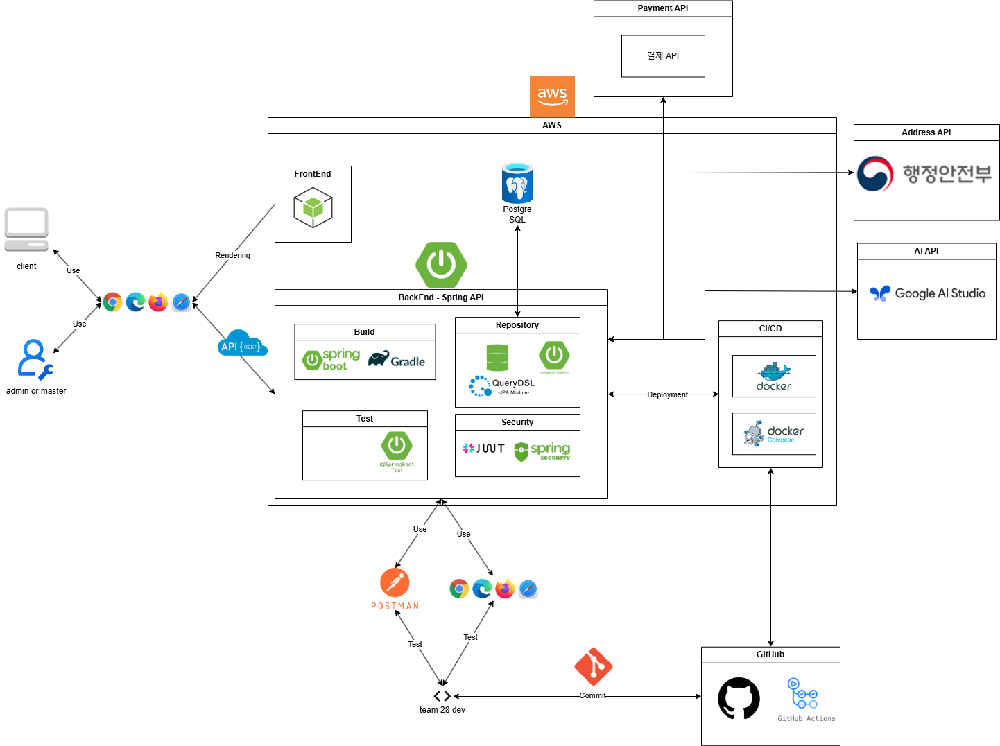

# 28Delivery BackEnd

## 프로젝트 개요 및 목표

28Delivery BackEnd 프로젝트는 ‘00의 민족’과 같은 **주문 관리 플랫폼**의 백앤드 부분을 **스프링 부트 기반의 모놀리식** 방식으로 개발한 팀 프로젝트입니다. 이 팀 프로젝트의 목적은 광화문 근처에서 운영될 음식점들의 배달 및 포장 주문 관리, 결제, 그리고 주문 내역 관리 기능을 제공하는 플랫폼 개발하는 것입니다. 이에 대하여 28Delivery BackEnd 프로젝트는 기능별 API를 개발하여 프론트앤드 개발자에게 필요한 데이터를 제공해주며 이러한 기능들을 자동화하여 서비스로 개발하고 관리합니다.

배포 링크: [http://3.39.9.229:8080/swagger-ui/index.html](http://3.39.9.229:8080/swagger-ui/index.html)

## 프로젝트 상세 내용

### 주요 기능

- **회원 관리**  
  - 회원 가입, 로그인, 로그아웃, 비밀번호 변경, 사용자 정보 조회 및 삭제
  - 고객, 가게 주인, 관리자 별 접근 권한 관리
- **음식점 및 메뉴 관리**
  - 가게 및 메뉴 등록, 조회, 수정, 삭제
  - 카테고리를 통한 음식점 분류
  - 가게 주소 추가, 조회, 수정, 삭제
  - AI를 통한 메뉴 설명 자동 생성
- **주문 및 배송지 관리**   
  - 주문 생성, 상태 변경, 상세 조회, 주문 취소
  - 실시간 주문 확인, 내역 목록 조회
  - 배송지 생성, 조회, 수정, 삭제
- **리뷰 관리**
  - 리뷰 생성, 검색, 조회, 수정, 삭제
  - 특정 음식점 평점 보여주기
- **관리자 기능**
  - 사용자 계정, 음식점, 주문, 배송지, 리뷰 관리(CRUD)
  - AI API의 로그 관리 

### 사용 기술

- **API 설게 및 문서화**
  - RESTful API 원칙에 따른 설계
  - Swagger를 이용한 REST API 엔드포인트 문서 제공으로 클라이언트와의 원활한 소통 지원
- **데이터베이스**
  - 사용자를 제외한 모든 엔티티의 식별자는 UUID 사용
  - Audit 필드(created_at, created_by, updated_at, updated_by, deleted_at, deleted_by)로 데이터 감사 로그 기록
  - 데이터 삭제시 소프트 삭제
- **인증 및 보안**  
  - JWT와 Spring Security를 활용한 인증 및 권한 관리
  - BCrypt 해시 알고리즘을 사용한 비밀번호 암호화
  - Spring Validator를 이용한 데이터 유효성 검사
- **테스트 코드**  
  - JUnit, Mockito 등을 활용한 단위 및 통합 테스트

## 기술 스택

- **IDE:** InteliJ Ultimate 
- **언어:** Java 17
- **프레임워크:** Spring Boot
- **보안:** Spring Security, JWT
- **데이터베이스:** Spring JPA, PostgreSQL
- **빌드 도구:** Gradle
- **테스트:** JUnit 5, Mockito, Spring Test
- **기타:** Lombok, Hibernate Validator
- **배포:** AWS EC2, Docker, Docker-compose
- **API:** Google AI Studio, 주소기반산업지원 서비스 API
- **버전 관리:** Git

## ERD

## 서비스 구성 및 실행 방법

### 서비스 설계

- 프론트앤드 부분은 담당 개발자가 개발 예정
- kubernates는 추후 MSA로 확잘할 때 사용 얘정

### 실행 방법

[Swagger API 참고](http://3.39.9.229:8080/swagger-ui/index.html)

사용 시나리오오
1. 회원가입 - 로그인
2. (관리자) 가게 생성 - 가게 주소 설정
3. (관리자) 메뉴 생성/수정 
4. (고객) 가게 섬색 및 조회 - 메뉴 생성 및 조회 - 주문
5. (고객) 메뉴 리뷰 남기기기

## 팀원 소개

|  |  |
|-----------------|----------------------------------|
| 최동인 |  <ul><li>팀장</li><li>API 설계</li><li>Restaurant/Menu/Category API 개발 및 테스트</li><li>리팩토링</li><li>프로젝트 총괄 관리</li></ul>     |
| 조규성 |  <ul><li>DB 설계</li><li>Menu API 개발 및 테스트</li><li>AI API 적용</li><li>CI/CD 배포</li><li>Swagger API 문서화</li></ul> |
| 강 민 |   <ul><li>DB 설계</li><li>User API 개발 및 테스트</li><li>보안 및 인증</li><li>CI/CD 배포</li></ul> |
| 엄은진 |  <ul><li>DB 설계</li><li>Address API 개발 및 테스트</li><li>Admin User API 개발 및 테스트</li><li>CI/CD 배포</li></ul>  |
| 이소연 |  <ul><li>API 설계</li><li>Order/Review/Payment API 개발 및 테스트</li><li>Admin Order/Review API 개발 및 테스트</li><li>리팩토링</li></ul>    |

